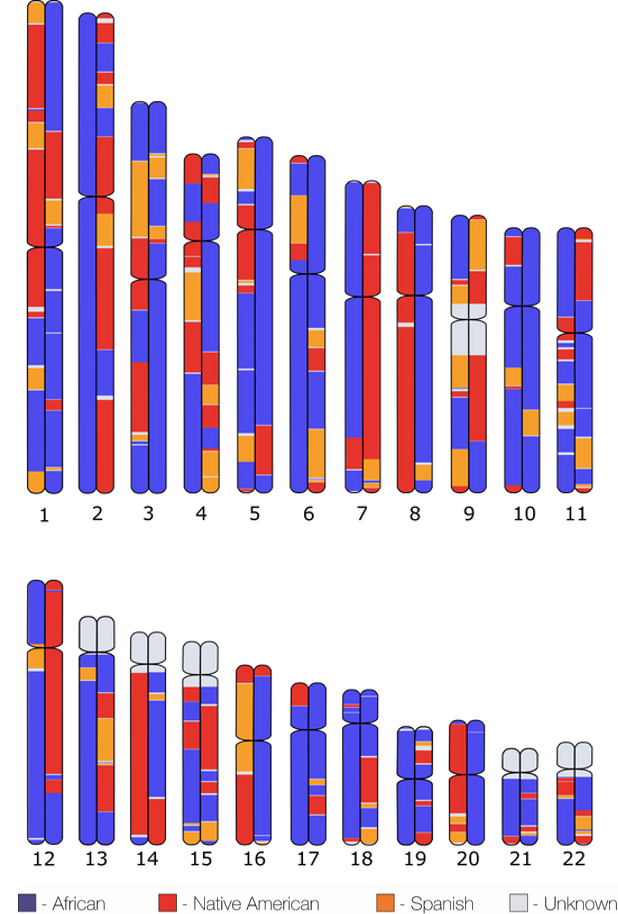

# Summary

Tagore is a Python utility for the illustration of genomic features on
human chromosome ideograms. It was designed for the visualization of
local ancestry tracts, but it can be used for a wide variety of genomic
features, including genetic variants and chromatin states. Tagore is
freely distributed on several platforms, easy to use, and supports the
generation of high-quality, publication-ready images.

# Statement of need

A wide variety of functional, comparative, and computational genomics
techniques are used to link the DNA sequence of the human genome to
biology, health, and evolution [@RN2; @RN4; @RN1; @RN3; @RN5]. Application of these techniques
yields genome feature annotations, which are coordinate-based
delineations and descriptions of the functional and evolutionary
elements in the genome. Genome annotations include gene locations along
with their exon-intron structure, distributions of epigenetic features,
such as methylation sites and histone modifications, and the locations
of genetic variants, including single nucleotide variants (SNVs),
insertion-deletions (indels), and copy number variants (CNVs).
Visualization of genome annotations helps to provide an intuitive sense
for their distribution and relationships and is widely used in the
scientific literature [@RN6].

The Tagore utility allows users to illustrate genome annotations on
human chromosome ideograms -- diagrammatic representations of human
chromosomes showing their relative sizes together with the positions of
the centromeres and chromosome arms. Tagore was designed to visualize
genome-wide distributions of ancestry in the form of local ancestry
tracts that illustrate the ancestral origins for specific chromosomal
segments (loci) (Figure 1). Nonetheless, the visualization utility
provided by Tagore is generic and can be used to support a wide variety
of genome feature annotations, including SNVs, indels, CNVs, and
epigenetic states.

{width="3.1351924759405074in"
height="4.435643044619423in"}

Figure 1. **Local ancestry ideogram produced by Tagore.** Chromosomal
regions (loci) with African (blue), European (orange), and Native
American (red) ancestral origins are shown for 22 human autosomes.
Regions with unknown ancestry are shown in gray. This genome is from a
participant in the ChocoGen research project
(<https://www.chocogen.com/>) from the Colombian department of Chocó
[@RN7; @RN8].

Tagore has been used in several studies to illustrate local ancestry
tracts along the human genome, and it has been incorporated into several
independently genome annotation utilities [@RN20; @RN15; @RN19; @RN18; @RN17; @RN16]. For example, Tagore
has been integrated with local ancestry inference packages like Gnomix
(<https://github.com/AI-sandbox/gnomix>) and rf-mix reader
(<https://rfmix-reader.readthedocs.io/en/latest/index.html>) [@RN14; @RN12; @RN13].
It has also been included as part of the CoFrEE method to visualize CNV
data [@RN11]. Finally, the need for a utility like Tagore is underscored
by the fact that its bioconda package has been downloaded 9,705 times
(as of March 14, 2025).

# Implementation 

Tagore is written in Python and requires Python 3.6+
(<https://www.python.org/downloads/>), the RSVG libarary for rendering
SVG files (<https://cran.r-project.org/web/packages/rsvg/index.html>) ,
and the Click package for creating command line interfaces
(<https://click.palletsprojects.com/en/stable/>). It can be installed
from GitHub (<https://github.com/jordanlab/tagore>), PyPI
(<https://anaconda.org/bioconda/tagore>), or bioconda
(<https://anaconda.org/bioconda/tagore>). The Tagore utility merges the
genome annotation visualization and image generation process, which
would otherwise be slow and labor intensive, entailing a series of
manual data integration and conversion steps, into a single step that is
fast and easy to implement. It takes Browser Extendable Data (BED)
format-like input files, where each row represents a genomic feature on
a specific chromosome, and generates high resolution, vector graphics
images that are publication-ready. Input file rows include chromosome
coordinates, feature shapes and sizes, and the chromosome copy
(haplotype) on which to render the feature. Tagore supports both hg37
and hg38 human genome builds.

The name Tagore is an homage to Rabindranath Tagore, a Nobel Laureate
and major figure of the Bengal Renaissance. Tagore spoke out against
racial prejudice and espoused the principle respect for all people,
regardless of ancestry or ethnic background.

# Acknowledgments

LR, ATC, ABC, and IKJ were supported by the IHRC-Georgia Tech Applied
Bioinformatics Laboratory (Award Number: RF383 to IKJ). LR, ABC, and LMR
are supported by the Division of Intramural Research of the National
Institute on Minority Health and Health Disparities at the National
Institutes of Health (Award Numbers: ZIAMD000016 and 1ZIAMD000018 to
LMR). LMR was supported by the National Institutes of Health
Distinguished Scholars Program. **\
**

